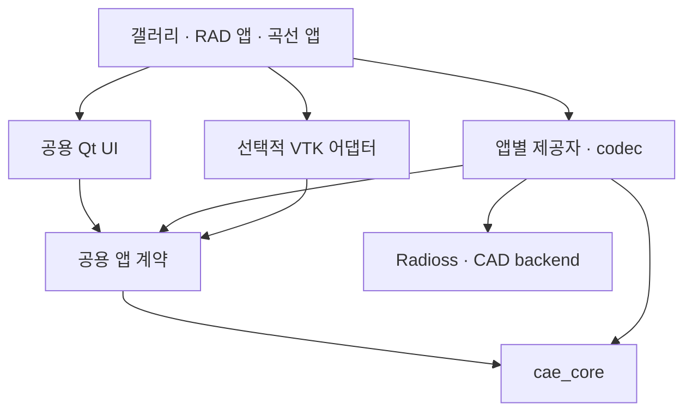

# 공용 CAE 자산·기반 실행 계획

원계획 기준일: 2026-10-29. 목표 정렬·구현 대조: 2026-11-02. 현재 구현 기준은 Prep 병합 `3ceaf44`, Workbench 병합 `865ee15`이다. 상태: **구현된 기반과 남은 설계·작업 계획**. 달성할 제품 목표·동일 과업 T1–T6·단계 G0–G4의 완료 기준은 [DESIGN의 「달성 목표와 제품 완료 기준 (2026-11-02)」](../DESIGN.md#delivery-goals)에 단일 정의한다. 이 문서의 목표 경로·계약·갤러리는 구현 완료 목록이 아니다. 현재 실행 코드와 파일 계약은 [ARCHITECTURE](../ARCHITECTURE.md), 실행 방법과 지원 범위는 [README](../README.md)를 따른다.

이 문서는 공용 자산의 설계와 기술 작업 P0–P9를 위 목표에 맞춰 연결한다. A/B/C는 기존 범위를 구별하는 기록이며, A의 완료 보고나 기존 리뷰를 현재 제품 목표의 완료로 전용하지 않는다. 현재 구현 근거는 [단계별 작업서 19절](execution-stages.md#current-progress), 남은 작업의 번호·범위·완료 기준은 [중앙 잔여 목록](execution-stages.md#remaining-work)에 둔다. 이 문서의 P 번호를 미완료 건수로 다시 합산하지 않는다. 19절의 존재는 앞의 1–18절이 완료됐다는 뜻이 아니다. Workbench 소비자와 두 저장소의 변경 책임은 [재사용 계획](workbench-reuse-plan.md)을 따른다.

메셔의 실제 재사용 코드·알고리즘/상용 매뉴얼 조사·SDK 실험과 착수 근거는 [실현 가능성 로드맵](mesher-feasibility-roadmap.md)에 둔다. 고급 중립면·hex/hybrid 항목은 이름을 적었다고 구현 가능한 것으로 선정한 것이 아니며, 기능별 실증 뒤 제품 연결 여부를 결정한다.

## 1. 목적과 이번 계획의 범위

CAELab Prep에 여러 공학 프로그램이 사용하는 공용 GUI 자산과 CAE 개발 기반을 축적한다. OpenRadioss/OpenCourant는 첫 적용 대상이고 현재 RAD 편집기는 첫 소비자다. 실행형 갤러리도 같은 공용 코드를 사용하는 정식 산출물이다.

2026-10-29에는 계획 문서만 작성했으며, 이후 공용 위젯·셸·provider/저장 계약과 G1–G4의 구현 묶음이 병합됐다. 현재는 RAD 객체 생성·할당, 곡선/집합/조건, tri/tet CAD 후보 채택과 Starter/Engine 출력, 실제 Workbench의 공용 숫자 입력·독립 문서 전달까지 연결돼 있다. 다음 변경은 이 기반을 다시 만드는 작업이 아니라 아래 계획과 중앙 잔여 목록의 부족분을 닫는 작업이다. 이번 갱신 자체는 문서만 변경하며 새 제품 기능이나 검증 결과를 추가하지 않는다.

목표는 다음 세 가지를 함께 확보하는 것이다.

1. **외관 자산:** 정보 밀도, 글자·아이콘·간격·상태 표현을 제어할 공통 규칙과 리소스.
2. **실행 가능한 공학용 부품:** 트리·속성·단위·벡터·표·곡선·선택·뷰포트·도킹을 실제 값과 연결하는 컴포넌트.
3. **공용 앱 기반:** 문서·명령·선택·저장·작업·자동화의 작은 계약과 구현. 솔버·CAD 규칙은 적용 모듈에 유지한다.

HyperMesh·PrePoMax·Naksha·Abaqus/CAE·COMSOL·midas NFX·MeshFree·BeidPrep 각각의 방식으로 같은 지원 과업을 수행하는 GUI와 재사용 가능한 공통 기반을 목표로 한다. 제품별 정보 구성·명령 그룹·작업 순서·편집/확정 상호작용을 구현하며, 모델·검증·명령·Undo·저장과 편집 부품은 공유한다. 모든 제품의 물리 모델·솔버를 전수 복제하거나 자체 CAD 커널을 개발하겠다는 약속은 아니다. 실제 Workbench의 위젯 소비와 파일 전달은 G4의 필수 확인이며, 독립 QWidget 시험이나 갤러리 실행만으로 대체하지 않는다.

## 2. 확인한 출발점

아래는 2026-10-29 원계획의 출발점 기록이다. 이후 분리된 코드와 현재 지원 범위는 ARCHITECTURE/README로 확인하며, 이 표를 현재 코드의 전수 조사 결과로 읽지 않는다.

| 확인 대상 | 확인한 사실 | 계획에 반영할 점 |
|---|---|---|
| README의 `native-editor.png` | 당시 자체 Qt/VTK RAD 편집기. 두 셸과 소수 속성을 표시하는 초기 실행 화면 | 구현 기록으로 유지한다. 목표 외관이나 갤러리의 대표 장면으로 고정하지 않는다 |
| BeidPrep 1.0.1 | Windows에서 열기·3D·저장·재열기 수행. GUI 재료 수정은 미완료, 저장 조건 변화 발견 | 외관 참고와 모델 보존 검증을 구분한다. 상세는 [시험 기록](beidprep-evaluation.md) |
| BeidPrep 2.0 / Naksha | 이 계획에서 실제 실행 검증한 제품이 아님. Naksha의 과거 확인은 공개 화면·영상 조사 | 공개 자료의 외관 참고와 성능·기능 실측을 혼동하지 않는다 |
| `ui/theme.py` | 자체 SVG 경로와 단일 스타일 문자열. 트리 최소 높이 26px, 입력 상하 padding 등 | 기존 크기를 공용 표준으로 복제하지 않고 참조 화면과 비교해 토큰을 정한다 |
| `ui/main_window.py` | Action·도킹·트리·폼·입력 초안·파일 작업·종료 확인을 함께 소유 | 화면 부품과 문서 수명 주기를 나누되 기존 편집 보존 장치를 함께 옮긴다 |
| `cae_core/document.py` | Qt·솔버를 모르는 문서·자원·명령·선택·저장 기준점. 당시 명령은 한 자원 상태의 Undo/Redo | 기존 코어를 확장 출발점으로 사용한다. 모든 CAE 의미나 다중 자원 트랜잭션이 이미 있는 것으로 보지 않는다 |
| `application/session.py` | RAD 카드·INCLUDE·메시 투영·`.caeprep` 저장을 다루는 당시 PrepSession | 공용 세션의 작은 계약과 RAD 구현을 분리한다. 일반적인 클래스 이름만으로 공용화됐다고 판단하지 않는다 |
| `ui/viewport.py` | VTK 메시 표시·카메라·원본 ID 역매핑·단일 절점/요소 선택 | 렌더러와 공용 뷰포트 프레임을 구분하고 선택·원 ID 보존을 유지한다 |

당시 구조에서 지적한 문제는 여백만이 아니었다. RAD 카드 분류와 공용 트리, 필드 파싱과 속성 위젯, 파일 형식과 문서 수명 주기의 결합을 줄이는 것이 이행 과제였다. 분리된 코드의 존재와 실제 과업을 완수하는 재사용 기반의 완성은 별도로 검증한다.

## 3. 참조 화면과 디자인 결정

[7제품 상세 벤치마크](benchmarks/2026-10-30/README.md)의 메뉴·입력·결과·취소/저장 근거와 [공용 자산 요구](benchmarks/2026-10-30/common-assets.md), PrePoMax를 포함한 [현재 8방식의 출처·구현·한계 표](ui-reference-variants.md#source-to-implementation-map)를 출발점으로 사용한다. 자료 미확인을 구현자의 추정으로 채우거나 정적 그림을 실행 결과로 승격하지 않는다. 동일 과업의 시작 상태·조작·결과와 근거의 확인 수준은 G0에서 고정한다.

기존 [참조 제품 비교](gui-reference-matrix.md)는 관찰 자료이며, 일부 제품의 패턴을 골라 하나의 화면으로 합치면 8방식 목표를 달성한 것으로 보지 않는다. 각 제품의 근거와 미확인 부분을 구분하고, 미확인 상호작용은 확인 과제로 남긴다.

### 같은 과업을 수행하는 8가지 작업 방식

각 방식의 과업 범위와 합격 기준은 DESIGN의 T1–T6를 따른다. 배치·색·제품명만 바꾼 화면은 충분하지 않다. 같은 입력 모델에서 프로그램별 탐색·명령 진입·선택·편집·확정/취소의 흐름을 제공하고, 그 결과는 공통 모델과 명령으로 일관되게 반영한다. GUI를 제품마다 복제하는 대신 표현과 상호작용을 어댑터로 분리한다.

기존 두 프로필 계획은 이 목표로 대체한다. 첫 구현의 완료를 Abaqus 한 방식으로 제한하거나 COMSOL 및 나머지 방식을 선택적 후속 작업으로 미루지 않는다. G1부터 해당 단계의 동일 과업을 8방식에서 검증한다. 실제 원제품 접근이 없는 항목은 문서/영상 근거와 실제 실행 근거를 구분하고 비교 미완료를 명시한다.

### 외관 규칙의 구체화

| 자산 | 첫 구현에서 정의할 내용 | 확인할 장면 |
|---|---|---|
| 밀도·글꼴 | 본문/제목/표 숫자 글꼴, 행·입력·툴바 높이, 들여쓰기, 패딩, 그룹 간격 | 같은 화면 크기에서 긴 트리·여러 속성·표가 함께 있는 장면 |
| 상태·색 | 기본·hover·선택·포커스·비활성·입력 오류·경고, 선택/미선택 형상의 대비 | 키보드 포커스, 선택 행, 잘못된 숫자, 비활성 명령 |
| 아이콘 | 의미별 키, 벡터 원본, 트리/툴바/명령 그룹별 크기와 상태 | 작은 트리 아이콘과 도구 아이콘을 실제 표시 크기로 비교 |
| 패널·도킹 | 제목·구분선·로컬 도구, 접기/숨기기, 최소 크기, 배치 저장 | 창 축소, 도킹 이동, 메시지 접기, 프로필 전환·재시작 |

아이콘의 초기 묶음은 문서/이력, 형상/부품, 메시/요소, 재료/단면, 하중/구속, 접촉/집합, 보기/선택, 곡선/결과, 작업/상태다. 서로 다른 객체를 모두 같은 문서 아이콘으로 표시하지 않는다. 지원하지 않는 명령을 아이콘 수를 늘리기 위해 활성화하지 않는다. 외부 아이콘은 해당 리소스의 허용 조건을 확인하고 자체 CAE 도형과 일관되게 조정한다.

갤러리 카탈로그의 등록 정보에는 자산의 의미 키·용도·원본 경로·사용 부품/장면·구현 상태·출처/허용 조건을 둔다. 리소스와 실제 사용 코드를 함께 관리하며 이를 위한 별도 데이터베이스나 새 제작 도구부터 만들지 않는다.

압축형 공학 UI를 기본으로 설계하되 글자 크기·고배율 가독성을 보존한다. 최종 행 높이·패널 폭은 현재 CSS 값을 일괄 축소해서 결정하지 않는다. 먼저 참조 자료의 해상도·배율·주요 영역과 자체 실행 화면을 비교해 초기 토큰을 정한다. 현재 필수 비교 환경은 DESIGN의 Windows 1920×1080/100%, 3840×2160/200%와 축소 창 960×640을 따른다. 기존 2560×1440/150%는 보조 검사로 유지할 수 있으며 필수 환경을 대신하지 않는다. 이는 후속 확인 계획이며 아직 실행한 결과가 아니다.

## 4. 구현된 모듈과 남은 의존 경계

아래 표는 원계획의 책임을 현재 경로에 대응시킨다. `persistence/`, `applications/radioss/`, `gallery/`라는 가칭 디렉터리를 만드는 일 자체가 남은 납품은 아니다. 현재 import와 공개 CLI를 유지하며 실제 부족한 책임만 확장한다.

| 구현 경로 | 현재 책임 | 남은 경계 |
|---|---|---|
| `cae_core/document.py` | Qt·솔버 없는 Document/Resource/명령·선택·저장 기준점 | 한 자원 상태 명령을 유지. 일반 다중 자원 관계·배열/규모는 N16/N17 |
| `application/contracts.py` | ObjectRef·PropertySpec·OperationSpec/Request와 host 계약 | 새 기능은 같은 검증·명령 경로를 소비 |
| `application/storage.py` / 앱별 codec | 공용 원자 저장 컨테이너, RAD/중립 문서의 별도 payload | RAD v1 읽기 호환 유지. 대형 binary payload는 N17 |
| `ui/design/`, `ui/widgets/` | 토큰·아이콘·트리·속성·숫자/단위·벡터·표/plot | 중립/RAD CSV·plot 직접 편집은 PR #17 N15에서 같은 부품으로 연결 |
| `ui/actions.py`, `ui/shell.py`, `ui/prep_controller.py` | 공용 Action·초안/파일 조정·도킹/뷰포트 프레임과 앱 호출 | 원제품별 실제 작업 비교·전체 연속 작업은 중앙 N03–N11 |
| `ui/viewport.py` | 주입되는 VTK renderer, 승인된 정본 선택·PART 숨김/격리 | 일반 메시 수정/재연결 N18, 대형 projection N17 |
| `application/session.py`, `rad_provider.py`, `radioss/` | RAD 원문·native 의미·생성/참조 명령·codec·공용 host 연결 | solver별 규칙 소유 유지. 케이스 N01/일반 모델 관계 N16 |
| `adapters/gmsh_*`, `application/mesh_candidates.py` | 별도 SDK worker·후보 검증·원자 채택 입력 | 일반 수정 N18, 조건부 메시 확장 N22–N26 |
| `ui/gallery.py`, `ui/catalogue.py`, `application/neutral.py` | Qt-only 재료/곡선 소비자와 부품 카탈로그 | RAD와 독립된 codec 유지. 카탈로그를 실무 모델링 완료로 세지 않음 |
| Workbench `study_config.py` / 프로그램 연결 | 공용 NumericEdit 소비·독립 Prep 문서 실행 | Windows 소비 N14, RAD 실행 W3는 N21 |

```mermaid
flowchart TB
    Apps["갤러리 · RAD 앱 · 곡선 앱"] --> UI["공용 Qt UI"]
    Apps --> Providers["앱별 제공자 · codec"]
    Apps --> Renderers["선택적 VTK 어댑터"]
    UI --> Contracts["공용 앱 계약"]
    Providers --> Contracts
    Contracts --> Core["cae_core"]
    Providers --> Core
    Providers --> Backends["Radioss · CAD backend"]
    Renderers --> Contracts
```

화살표는 import 의존 방향이다. 실제 값은 앱이 소유한 문서/자원에 한 번만 보관한다. 트리·속성·그래프·렌더러의 표현 자료는 그 문서의 조회 결과이며 별도 편집 원본을 소유하지 않는다. Qt 모델/뷰와 delegate는 표현 계층에서 사용하고 코어를 QObject로 만들지 않는다.

공용 위젯·앱 셸·계약 모듈은 VTK나 RAD 구현을 import하지 않는다. 앱 조립 지점이 구체 렌더러를 생성해 중립 프레임에 주입한다. `__init__`에서 구체 렌더러를 일괄 import하지 않는다. 기본 부품 갤러리와 곡선 앱은 VTK 없이 Qt 기반으로 실행하고 메시 장면만 VTK를 선택적으로 사용한다. 현재 설치 옵션과 지연 import의 구현 상태는 README/ARCHITECTURE를 따르며, 기존 `.[gui]` 사용법은 호환한다.

문서 교체·명령 직렬화·저장·dirty·실제 파일 결과는 애플리케이션 세션이 소유한다. GUI 컨트롤러는 입력 초안·파일 대화상자·저장/취소 확인과 세션 호출을 조정하고, 셸은 그 컨트롤러와 Action/패널을 조립한다. CLI·자동화는 GUI 컨트롤러를 거치지 않고 같은 세션 규칙을 사용한다.

상태는 다음과 같이 구분한다.

| 상태 | 소유 위치 | 저장·변경 원칙 |
|---|---|---|
| 영속 문서 | 앱의 문서/자원 | 확정 값·객체 관계·집합 정의. 명령·Undo·dirty·작업 파일 대상 |
| 세션 | 문서 세션 | 현재 선택·가능 동작·진행 작업. 선택 변경 자체는 모델 dirty를 만들지 않음 |
| 편집 초안 | 편집 컨트롤러 | 아직 적용하지 않은 숫자·표 입력. 문서가 바뀌어도 조용히 소실시키지 않음 |
| 사용자 환경 | 앱/프로필별 설정 | 도킹 배치·최근 파일·표시 선호. 모델 파일과 별도로 관리 |
| 파생 표시 | 렌더러/뷰 캐시 | VTK 투영·검색 인덱스 등. 문서/자원 개정에 맞춰 갱신하며 정본으로 저장하지 않음 |

복잡한 다중 파트·혼합 자유도·집합/접촉·해석 케이스·대용량 자료의 구조는 [모델·데이터 설계](cae-model-data-design.md)를 따른다. 파트 원형/배치·FE component·source를 구분하고, 고정 6자유도나 part별 전체 메시 사본을 전제로 설계하지 않는다. 참조·필드·배열 소유 경계는 P1부터 정한다. G1의 재료·단면 생성/할당과 삭제 영향에 필요한 관계·복합 명령은 그 단계에 포함하며 전체 묶음 B 이후로 미루지 않는다. G2의 조건/케이스와 G3의 CAD 후보 채택에 필요한 확장을 이어 붙이고, 큰 규모의 추가 확인은 P6b/c의 별도 범위로 관리한다.

## 5. 유지·확장할 공용 계약

아래 최소 계약은 현재 RAD와 중립 provider·공용 위젯에서 사용한다. 새 기능도 같은 경계에 연결하며 임의 솔버의 전체 물리를 기술하는 범용 스키마부터 만들지 않는다. 곡선 드래그 등 아직 없는 동작의 규칙은 완료 주장과 구분한다.

| 계약 | 전달할 정보/동작 | 소유 경계 |
|---|---|---|
| 문서 세션 | 문서 이름·ID·개정·dirty·가능 동작 조회, 변경 구독, Undo/Redo, 저장 요청 | 앱이 문서·수명 주기를 소유. RAD 파일/INCLUDE 해석은 RAD 구현 |
| 트리·속성 제공자 | 객체 참조, 표시 이름·부모·아이콘·상태, 속성의 그룹·종류·값·단위 문맥·허용값·읽기 전용·오류 | 솔버가 의미·규칙을 제공. 위젯은 내부 키를 라벨로 추측하지 않음 |
| 편집 명령 | 대상 참조·기대 개정·필드·값·단위 문맥, 성공 변경/검증 오류 반환 | 최종 검증·모델 변경·Undo는 세션/코어의 같은 경로 |
| 선택·표시 | 활성 객체 참조, 선택 엔티티 집합, 관련 형상 강조, 원본 ID와 표시 인덱스의 매핑 | 공용 서비스가 상태를 동기화. 재료→부품 등 의미 연결은 제공자가 계산. 렌더러는 후보 pick을 전달하고 승인된 선택을 강조 |

파일 작업은 공용 FileTask의 상태·오류·산출물과 세션 이벤트를 사용하고, CAD 후보는 worker의 실제 취소/실패와 문서 채택을 구분한다. 독립 API/CLI는 같은 모델 명령을 호출한다. PR #21에서 병합한 N19/N20은 같은 열린 GUI의 주 스레드 owner에 IPC를 연결하고 얇은 MCP adapter로 노출한다. 실제 공개 client 검사와 정확한 SHA의 CI는 중앙 N 작업표에서 구분한다.

Action 정의는 ID·표시 이름·아이콘·단축키·문맥·활성/체크 상태와 실행 연결을 가진다. 메뉴·툴바·명령 탭·우클릭은 같은 정의를 사용한다. 지원 여부는 앱의 가능 동작에서 정하고, 갤러리에서만 동작하는 도구를 RAD 기능으로 표시하지 않는다.

상세 계약을 정할 때 다음 조건을 명시한다.

- **편집 중 값:** 입력 초안은 확정 값과 분리한다. scalar는 유효한 값만 확정하고 잘못된 값은 이동/저장을 막아 해당 입력과 오류를 유지한다. Escape/취소로 초안을 명시적으로 폐기할 수 있고 닫기의 변경 폐기 동작도 유지한다. 벡터·표 붙여넣기는 전체 검증 후 한 명령으로 적용한다. N15에서 추가할 곡선 드래그는 미리보기 후 놓을 때 한 명령, Escape로 취소한다. 선택 전환·Undo·저장·닫기의 초안 처리에 같은 규칙을 적용한다. 다른 호출자가 문서를 바꾸면 현재 개정을 다시 확인하고 초안을 조용히 덮어쓰지 않는다.
- **단위:** 현재 RAD는 덱/카드 단위 문맥을 보존한다. 알 수 없는 단위를 SI로 추측하지 않는다. 확인된 입력 덱 단위의 탄성계수·밀도·길이·속도·힘/모멘트는 provider가 표시 단위로 환산하고 Apply에서 원 단위로 되돌린다. FUNCT 축과 미해석 카드의 물리량은 추정하지 않는다.
- **명령 단위:** 한 번의 벡터 입력·곡선 표 붙여넣기는 하나의 Undo 작업으로 처리하며 N15의 곡선 드래그에도 같은 규칙을 적용한다. 현재 한 자원 snapshot 경로를 우선 활용한다. 여러 자원을 동시에 바꾸는 명령은 rollback·참조 검사 정책을 정한 뒤 추가한다.
- **곡선 의미:** `FUNCT`의 축을 무조건 응력–변형률로 표시하지 않는다. 실제 사용 관계·축 이름·단위가 확인되면 제공자가 전달하고, 미확인 자료는 일반 X/Y와 확인된 단위 문맥만 표시한다. 현재 RAD는 FUNCT 생성/삭제·행 편집·CSV와 실제 CLOAD 참조를 지원한다. N15는 두 host의 CSV/plot drag와 RAD/VTK 없는 중립 실행을 각각 검사해 PR #17에 병합했다. 중립 자료의 `Associated curve` 참조를 재료 구성법칙이나 하중 연결의 구현으로 보고하지 않는다.
- **객체 참조:** UI 행 번호·VTK 배열 인덱스를 정본 ID로 쓰지 않는다. 현재 정수 절점/요소 ID와 자원 참조를 호환한다. 현재 생성/삭제 명령은 카드 UUID와 native ID를 구분하고 Undo·저장·재열기에서 정체성을 유지한다. 새 provider도 이 정책과 source별 native namespace를 명시한다.
- **pick 유효성:** 활성 재료/조건 객체와 절점/요소 선택을 하나의 ID 목록으로 강제하지 않는다. pick은 문서와 투영 자원 개정을 포함하며, 문서 교체·재메시 이후의 오래된 pick은 거부한다. 관련 형상 표시를 지원하지 않는 객체에 임의 연결을 만들지 않는다.
- **저장:** 현재 병합된 RAD 작업 문서는 컨테이너 v3에 케이스와 구조 편집을 저장하며 기존 v1/v2를 읽는다. N16 브랜치의 source archive/v5 후보(v1–v4 읽기)를 병합된 저장 계약으로 소급하지 않는다. native export의 원문/INCLUDE 보존을 유지한다. 공용층은 저장 인터페이스·실패/dirty 처리뿐 아니라 원자적 파일 교체·manifest/version·자원 payload 묶기의 재사용 기반을 제공한다. RAD 원문·patch·INCLUDE 의미와 실제 payload codec은 적용 모듈에 둔다. 갤러리 배치는 모델 파일과 별도로 저장한다.
- **곡선 파일:** CSV는 데이터 교환 형식이다. 단위·재료 속성·곡선 관계를 보존하는 작업 문서는 공용 컨테이너와 별도 재료/곡선 codec으로 저장한다. RAD 전용 `.caeprep` v1의 의미를 조용히 바꾸지 않는다. 작업 문서 payload에는 값·단위 문맥·축 메타데이터·재료/곡선 참조와 자체 버전을 포함한다.
- **작업:** 파일·메시 작업의 진행·취소 요청·실패·결과 파일을 공통 자료로 전달한다. UI는 완료되지 않은 작업을 성공으로 표시하지 않는다. 초기부터 세션별 변경 직렬화와 이벤트의 UI 스레드 전달을 유지하고, 백그라운드 결과는 대상 문서가 여전히 유효한지 확인한 뒤 채택한다. 저장 완료는 실제 저장한 상태를 기준점으로 삼고 이후의 변경을 저장된 것으로 표시하지 않는다. VTK/Qt 조작은 UI 스레드에서 수행하고 무거운 작업은 기존 worker 경계를 사용한다.
- **자동화:** GUI·스크립트·추후 MCP는 같은 조회/명령 경로를 사용한다. 이 단계에서 MCP 서버나 열린 GUI 접속 기능을 구현했다고 주장하지 않는다.

## 6. 외부 자산의 채택 순서

현재 실행 기반인 Qt Widgets/PySide6·VTK·Gmsh는 유지한다. 새 의존성은 필요한 한 역할을 실제 장면에서 비교하고 채택한다. 예제 코드 복사와 독립 라이브러리 사용, 호스트 전체 확장은 구분한다.

| 후보 | 맡길 역할 | 계획상 결정 / 채택 조건 |
|---|---|---|
| Qt 모델/뷰·delegate·QDockWidget | 트리·표·속성 편집·기본 도킹 | 기본 경로. 제공자와 모델을 연결하고 편집/선택 상태 보존 확인 |
| Qt ADS + PySide6 바인딩 | 자동 숨김·복잡한 도킹 | 비교 후보. Windows wheel·Qt/Shiboken 조합·라이선스·배치 복원을 확인한 뒤 도킹 backend로 선택. 실패해도 기본 도킹으로 진행 |
| pyqtgraph | 실제 곡선 표시·곡선 편집의 그래프 부분 | 우선 비교 후보. 표 데이터/Undo를 라이브러리에 소유시키지 않고 공용 곡선 모델을 투영. ParameterTree 전체 도입은 공용 속성 계약과 충돌 여부를 별도 확인 |
| Pint | 명시된 물리량·단위 검사/변환 | 알려진 단위 장면에서 검증할 후보. RAD의 단위 누락이나 솔버 규칙을 대신 추정하지 않음 |
| superqt | 검색형 콤보·범위/수량 입력 중 필요한 위젯 | 실제 장면에서 표준 Qt보다 이득이 있는 부품만 채택 |
| QtAwesome 등 | 범용 문서/상태 아이콘 | 리소스별 허용 조건과 스타일 일치를 확인. CAE 전용 의미는 자체 벡터로 보완 |
| FEBioStudio·BARAM·SALOME·ParaView·SMTK | 실제 CAE 설계·기능 기반 비교 | 현재 앱을 통째로 포크하는 결정과 구분. 필요한 컴포넌트의 결합·라이선스·이식 비용을 확인한 뒤 제한적으로 재사용 |

현재 프로젝트는 Python 3.11 이상과 조건별 PySide6 범위를 지원한다. 조사 당시 pyqtgraph/Pint 개발 브랜치의 Python 요구는 3.12 이상이고, Qt ADS 바인딩 저장소의 `.pyside-version`은 6.12.0이었다. 이는 안정 릴리스 전체의 요구조건을 뜻하지 않는다. `latest`를 일괄 설치하지 않고 **호환되는 릴리스 조합**을 찾아 Windows·갤러리·기존 RAD 앱에서 확인한다. 기존 지원 범위 변경이 필요하면 이유와 호환 경로를 함께 문서화한다. 이 문서 갱신으로 의존성을 추가하지 않으며 현재 선언은 `pyproject.toml`을 따른다. QDockWidget·QPainter plot·명시 단위 변환이 현재 채택 경로이고, ADS/pyqtgraph/Pint의 도입 자체를 필수 잔여로 세지 않는다.

## 7. 갤러리 장면과 자료

갤러리는 두 층을 가진다. 부품 화면에서 상태와 입력을 확인하고, 조합 화면에서 정보 밀도·비례·작업 연계를 확인한다. 공용 패키지가 갤러리 자료나 tests를 실행 의존성으로 사용하지 않게 한다. 갤러리는 개발·회귀 확인용 소비자이며, 실제 입력을 사용한 G1–G4의 작업 완료 증거를 대체하지 않는다.

| 장면 | 자료와 기능 | 실제로 확인할 작업 |
|---|---|---|
| 부품 목록 | 아이콘·버튼·메뉴·트리·속성·단위/벡터·표·메시지의 상태 목록 | 긴 이름·한글·지수 표기·입력 오류·비활성·키보드 포커스 |
| 재료/곡선 편집 | 탄성 상수·단위·벡터와 두 종류 이상의 곡선 자료, 표·그래프 | 값 수정·붙여넣기·단위 표시·검증 오류·Undo·저장/재열기 |
| 8방식의 작업 조합 | 같은 문서·제공자·실제 다중 부품 입력을 프로그램별 명령 그룹·탐색·편집 흐름으로 표시 | 해당 단계의 동일 과업을 각 방식에서 수행. 전환 시 값·선택·이력·초안 보존과 배치 복원 |
| 첫 RAD 적용 | 실제 사용자 RAD와 현재 소형 보존 시험 입력 | 기존 지원 필드 편집→저장→새 세션 재열기→RAD export. 미지원 원문 보존 |

조합 장면에는 여러 계층, 긴 이름, 펼침/접힘, 여러 속성 그룹, 표와 곡선을 포함한다. 현재 8절점/2셸 자료는 빠른 기능 확인에 남기고 대표 외관 장면은 다중 부품 셸/솔리드 자료로 구성한다. 형상이 다른 두 자료와 실제 사용자 파일 로딩 경로를 사용해 특정 모델 이름·개수에 맞춘 화면을 피한다. 필요한 자료는 재배포 가능한 소형 파일 또는 생성기로 제공한다.

갤러리 샘플도 실제 편집 가능한 자원과 명령을 사용한다. 샘플 결과·계산하지 않은 장면은 그 용도를 표시하고 실제 솔버 계산 결과처럼 보고하지 않는다. 작동하지 않는 메뉴를 채워 정보 밀도를 꾸미지 않는다.

## 8. 현재 코드의 이행 순서

아래는 원계획의 책임 분리 작업표다. 이미 분리된 항목을 다시 구현하지 않으며, 실제 코드와 현재 목표 사이의 부족분만 다음 변경의 대상으로 삼는다.

| 원계획 당시 위치 | 첫 분리 작업 | 반드시 보존할 동작 |
|---|---|---|
| `theme.py` | 토큰·아이콘·스타일 생성 분리 | 기존 앱에서도 같은 리소스 사용. 실제 크기·배율·선택 상태 확인 |
| `_action`, 메뉴·툴바 | Action 자료와 실행 연결 분리 | 현재 단축키·Undo/Redo·활성 상태, 한 명령의 중복 실행 방지 |
| `_refresh_tree` | 제공자 + Qt 모델/뷰로 분리 | 현재처럼 전체 clear/expand를 반복하지 않고 펼침·스크롤·선택·검색 보존 |
| `_refresh_fields`·초안 메서드 | 속성 제공자와 공용 편집기로 분리 | 미완료 입력·포커스·커서·오류·개정 충돌과 저장 전 편집 처리 |
| `_before_replace`·파일 작업·`closeEvent` | 문서 컨트롤러와 작업 표시 분리 | dirty 문서의 저장/취소, 저장 실패 시 창 유지, 비동기 열기/저장 오류 처리 |
| `PrepSession` | 공용 계약을 구현하는 RAD 제공자·codec으로 역할 분리 | 기존 GUI/CLI 호출 호환, 원문/INCLUDE·단위·patch·저장/출력 계약 |
| `MeshViewport` | 공용 프레임과 VTK/RAD 투영 연결 분리 | 원본 ID 역매핑, 문서 개정, 승인된 선택만 강조, 렌더러 종료 |
| QSettings·도킹 복원 | 안정적인 dock ID와 앱/프로필/배치 버전 키 | 프로필 간 배치 덮어쓰기 방지, 유실된 배치의 기본값 복구 |

각 분리는 한 사용자 작업이 끝까지 동작하는 작은 변경으로 연결한다. 모든 이름을 먼저 바꾸거나, UI를 새로 만들고 나중에 세션을 붙이는 일괄 재작성은 하지 않는다. 기존 실행 경로를 새 부품의 첫 소비자로 유지한다.

## 9. 작업 단위와 선행 관계

P0–P9는 구현 책임과 기술 의존성을 나눈 작업 단위다. 제품의 우선순위·완료 판단은 DESIGN의 G0–G4를 따른다. 특히 기존 P3 또는 A 종료를 G1 종료로 간주하지 않는다.

| 작업 | 구체적 산출물 | 선행 작업 | 끝났다고 판단할 증거 |
|---|---|---|---|
| P0. 참조·자산·호환 조사 | 8제품의 동일 과업·영역/상태와 출처, 자산 원본·라이선스/버전/결합, 필요한 후보 실행 비교, 입력/환경 고정 | 현재 코드/공식 참조 | G0의 근거·계약 고정. 정적 관찰·공식 조작 설명·원제품 실행·미확인을 구분하고 미확인 기능은 비교 완료로 처리하지 않음 |
| P1. 최소 계약 | 세션·속성·선택·변경 자료형과 RAD 연결, typed 참조/native scope·필드/자유도 문맥·배열 소유, 저장/초안·최소 작업/이벤트·직렬화 | P0의 현재 구조 조사 | 같은 계약으로 RAD와 비-RAD 자료를 조회·편집하고 다중 파트/필드를 고정 6자유도에 강제하지 않는 경계가 명확함 |
| P2. 외관·기초 부품 | 토큰·아이콘·Action·트리·속성/단위/벡터·기본 표/plot의 공용 구현과 부품 갤러리 | P0; 값 연결은 P1 | 전체 상태를 실제 위젯으로 보고 입력 수정/오류/변경 통지가 동작. 한 자원 묶음 편집이 한 Undo로 연결 |
| P3. 작업 조합·RAD 연결 | 공용 앱 셸·도킹·선택·뷰포트 프레임, 실제 재료·단면 작업과 공용 저장/codec, RAD 앱의 공용 부품 사용 | P1·P2 및 해당 생성/할당 명령 | P5와 함께 G1의 8방식 과업·파일 결과를 확인. 기존 scalar 수정이나 중립 작업 문서 저장만으로 종료하지 않음 |
| P4. 곡선·저장 재사용 | 곡선 생성·행 추가/삭제·CSV 교환·독립 재료/곡선 앱, 공용 컨테이너/codec 재사용과 실제 사용 관계 | P3 및 G2 관계 명령 | G2의 실제 곡선과 연결을 확인. 표/곡선 편집의 Undo와 비-RAD 저장 재열기를 확인하며 기존 점 또는 중립 참조만으로 대체하지 않음 |
| P5. 프로그램별 작업 방식 | 8제품별 표현·명령 그룹·탐색·편집/확정/취소 흐름과 프로필별 배치 저장 | P3와 병행; 과업별 명령과 P4를 단계에 맞춰 연결 | 같은 과업을 각 방식에서 수행하고 모델·검증·명령·이력·저장은 공유. 단순 배치 변경만으로 완료하지 않음 |
| P6a. 최소 자원·배열·채택 기반 | typed 참조·생성/삭제/할당/다중 자원 명령·최소 codec, 이후 geometry/mesh 자원·배열 소유 | P1; 화면 연결은 P3 부품 재사용 | G1의 실제 객체/관계 변경부터 원자적 Undo·저장을 확인하고 G3의 CAD 후보 채택으로 확장. B 전체와 100만 요소 확인은 선행하지 않음 |
| P6b/c. 공용 모델링·규모 기반 | 파트/배치/component/source·공유 메시, 조건 정의와 케이스 활성, 혼합 자유도·좌표, 참조/집합·복합 변경·대용량 인덱스/배열/저장 | P6a·P3; 범위는 모델·데이터 설계로 고정 | [묶음 B](cae-model-data-design.md)의 기능·관계·저장·native 범위와 고정 규모/응답 예산 통과 |
| P7a. 첫 CAD/메시 흐름 | Gmsh 생성 설정·국부 크기·품질·후보 채택·영역/재료 관계, 신규 RAD 생성 provider/ID 할당 | P6a·P3 및 기존 Gmsh 어댑터. B 전체는 불필요 | [작업서의 묶음 C](execution-stages.md)의 CAD→tri/tet→품질→조건→재열기를 G3의 Starter/Engine 생성·검사까지 연결 |
| P7b/c. 메시 확장·형상 변경 | 셸 준비·수정/재메시와 조건부 quad/sweep·중립면/hybrid를 구분. 복잡 자동 커널은 별도 연구/SDK 평가 | P7b 전체는 C와 P6b. P7c는 기능별 F0–F2 실증 선행 | 각 작업서의 지원 형상·수정·저장/native·실제 환경 조건 통과. 코드/API 확인이나 평가 종료만으로 기능 완료 처리하지 않음 |
| P8. 작업·자동화 경계 | 공용 작업 상태/취소/로그, in-process API와 CLI, 이후 열린 GUI 소유자에 연결하는 IPC/MCP | 기본 작업은 P3, CAD 작업은 P7, IPC/MCP는 세션/작업 계약 이후 | 작업 실패/취소·산출물과 문서 채택을 구분. 독립 호출과 GUI가 같은 명령 경로 사용. Workbench JobManager 중복 없음 |
| P9. 배포·사용 자산 | 공용 패키지·갤러리·Windows 앱의 실행 묶음, 최소 예제·사용법 | G1 기능부터 점진 배포; 최종 재사용/배포 확인은 G4 | VTK가 필요 없는 장면과 메시 장면의 의존성이 분리됨. 새 Windows에서 실행·외관·파일 흐름 확인. 패키지 생성만으로 G4 완료 처리하지 않음 |

P0의 근거 수집과 P1의 계약 초안은 병행할 수 있지만, 제품의 확인 순서는 G0→G1→G2→G3이며, G4의 실제 소비·API·Windows 배포는 완성된 기능부터 병행한다. 원제품 접근의 보류는 비교 미확인으로 남기며, 확정된 계약에 따른 G1 코어 구현 전체를 막지 않는다. P2/P3/P5의 표현·상호작용과 P6a의 실제 변경 명령을 G1에서 연결하고, P4와 조건/케이스를 G2, CAD 후보와 출력을 G3로 이어 간다. 기술 조사의 병행이 앞 단계의 미완료를 숨기는 이유가 되지 않는다. 실제 작업 상태는 [단계별 작업서 19절](execution-stages.md#current-progress), 소비자별 책임은 [Workbench 재사용 계획](workbench-reuse-plan.md)에 둔다. 확인되지 않은 인력·작업량을 전제로 완료 날짜를 약속하지 않는다.

## 10. 현재 구현과 다음 납품의 구분

G1의 재료·shell/solid 단면 생성·복제·안전 삭제·할당, G2의 곡선·집합·조건, G3의 CAD 후보·native 채택·Starter/Engine 출력은 병합됐다. G4의 실제 Workbench W1/W2 소비도 병합됐다. 이 범위의 코드·파일·Linux 렌더/solver 근거는 작업서 19절에 연결하며, 원제품 비교·전체 사용자 연속 작업·Windows 납품을 자동 통과로 바꾸지 않는다.

케이스 정의/조건 배정(N01), 첫 독립 MSH 입력(N02), 두 host의 CSV/plot drag(N15)는 PR #17의 명시 지원 범위로 병합했다. 제품별 비교·연속 작업·Windows(N03–N14)는 미완료다. Workbench RAD 실행(N21)은 PR #55의 실제 두 입력·필수 CI 통과 후 병합했다. IPC/MCP(N19/N20)는 PR #21의 실제 GUI·공개 client 및 최종 CI를 통과해 병합했다. 혼합 관계/대용량(N16/N17), 일반 메시 수정(N18)는 미완료 구현 요구이며, 선/준비면·중립면·quad·sweep·hybrid(N22–N26)는 기능별 실증을 선행하는 조건부 범위다. 정확한 입력·완료 조건은 [중앙 잔여 목록](execution-stages.md#remaining-work)을 따른다.

기존 `.caeprep` v1의 원문/patch 보존 계약과 공용 저장 절차는 살린다. 새 객체·관계의 저장 지원은 필요한 provider/codec에서 명시적으로 구현·검증한다. 중립 재료/곡선 파일의 성공을 RAD 새 카드 생성이나 실제 사용 관계의 보존으로 대신하지 않는다. 모든 솔버 카드 전수 지원이나 자체 CAD 커널 개발은 이 목표에 포함하지 않는다.

### 과거 묶음 A의 완료 조건 기록

묶음 A는 기존에 정의한 **공용 GUI·문서/명령/선택/속성/저장 계약의 첫 배포 범위(P0–P3)**다. 아래 A1–A8은 당시 보고와 증거를 대조하기 위해 보존한다. 여기의 ‘두 작업 화면’·‘기존 FUNCT 점’·‘고정한 참조 영역’은 현재 G1–G4의 요구 범위를 제한하지 않는다. 과거 특정 확인이 통과했더라도 현재 커밋과 현재 과업의 완료 증거는 별도로 확보한다.

| 조건 | 확인할 실제 결과 |
|---|---|
| A1. 범위 고정 | 구현 전에 참조 제품 비교의 채택/보류, 목표 조합 화면·상태, 지원 필드/형식·사용 자료·Windows 환경을 짧게 고정. 필수 자산과 비필수 보류를 구분 |
| A2. 실물 공유 | 토큰·아이콘·Action·트리·속성·단위/벡터·기본 표/plot·도킹·선택 연결을 갤러리와 RAD 앱이 같은 코드로 사용. 동일 부품을 앱마다 복제하지 않음 |
| A3. 두 작업 화면 | 기계 전처리 작업 공간과 재료/곡선 공간이 실제 데이터로 동작. 선택→값 수정→오류→Undo가 연결되고 미구현 도구를 작동하는 것처럼 채우지 않음 |
| A4. 실제 파일 범위 | 소형 시험 외에 다중 부품 RAD 한 개와 형상이 다른 지원 입력 한 개를 같은 열기 경로로 처리. 특정 이름·개수에 맞춘 분기 없이 현재 지원 필드와 기존 FUNCT 점 편집 |
| A5. 저장 보존 | RAD 편집→Undo/Redo→저장→프로세스 재시작·재열기→native 출력. 바뀐 값과 미편집 구속/IPLAS·미지원 원문·해결된 INCLUDE 관계 보존. 중립 재료/곡선도 RAD import 없이 자체 작업 문서로 재열기 |
| A6. 실패·초안 | 불완전 수치·잘못된 값·외부 수정·저장 실패·닫기 취소에서 확정 값/초안이 조용히 사라지지 않음. 실패한 명령의 부분 변경 없음 |
| A7. 외관·배치 | A1에서 고정한 참조 영역과 실제 Windows 화면을 비교. 긴 이름/한글·값/단위·상태·아이콘·정렬이 읽히고 잘리지 않음. 과도한 행/입력 높이·불필요한 고정 빈 패널 문제를 해결. 정한 배율·창 크기·도킹 이동·재시작 배치 복원 통과 |
| A8. 의존 경계 | 기본 부품·곡선 장면은 VTK 없이 실행, 메시 장면만 renderer 사용. 공용층이 RAD/Gallery 자료를 import하지 않으며 기존 GUI/CLI 실행 경로 유지 |

과거 외관 A7 역시 문서의 체크 표시만으로 통과를 입증할 수 없다. 고정한 장면의 실행 화면, 작성자·별도 검토자가 실제 확인한 범위와 발견한 불일치를 대조한다. 과거 리뷰가 존재한다는 사실을 현재 8방식의 동일 과업·Windows 품질 검토로 전용하지 않는다.

이전 계획에서 두 번째 레이아웃과 고급 곡선을 A의 후속으로 분리했던 범위는 역사적 기록이다. 현재는 G1의 8방식과 G2의 곡선 과업을 제외하는 근거로 사용할 수 없다. 반복 instance, 일반 재메시, 전체 물리/요소, MCP·후처리 및 대용량 구조의 범위는 각 목표·후속 계획에 명시하고 현재 과업에 필요한 관계·명령까지 일괄 연기하지 않는다.

### 묶음 B/C와 종료 판단

묶음 B는 [다중 파트·자유도·데이터 설계](cae-model-data-design.md)의 B1–B6과 고정 규모 예산에 대한 기술 범위다. 해당 조건을 만족하면 검증한 커밋·입력·환경과 함께 그 범위의 완료를 보고한다. A/B/C 중 일부의 완료가 제품 목표 전체의 완료를 뜻하지 않으며, 이미 확인된 기능은 회귀 기준으로 유지한다.

첫 CAD/메시 묶음 C는 [단계별 작업서](execution-stages.md)의 생성·품질·원자적 채택·조건/단위·저장·실패/취소·고정 native 범위 조건을 모두 통과하면 완료다. 중립면·일반 hex·모든 형상 변경 복구는 다음 단계이며 C의 종료를 막지 않는다. C만으로 상용 전처리기 전체 또는 실무 메시 편집 전체가 완성됐다고 하지 않는다. Workbench의 위젯 소비·독립 Prep 파일 전달·RAD 실제 계산도 [별도 조건](workbench-reuse-plan.md)으로 닫는다.

단계별 산출물은 기능·자료·환경·미완료를 명시해 배포한다. 최종 제품 목표의 판단은 DESIGN의 완료 기준을 따른다. 검사 수·진행률 대시보드·별도의 거대한 증명 문서는 종료 판단을 대신하지 않는다.

## 11. 검토와 기록 방식

외관은 실제 실행 화면으로, 편집은 실제 값과 파일로 확인한다. 메뉴 존재·검사 개수·해시를 제품 품질의 대체 지표로 삼지 않는다.

1. 각 제품과 Prep에서 같은 과업·대응하는 객체·시작/결과 상태를 맞춘 뒤 전체 화면과 트리/속성/툴바를 비교한다. 해상도·배율·행 높이·정렬·아이콘·패널 비율·빈 영역·문자 잘림을 기록한다. 물성/단면 수치와 작업 상태를 맞추지 않은 화면, Results 화면과 편집 화면의 단순 병치는 동일 과업 검증이 아니다.
2. 해당 단계의 실제 생성·할당·편집 과업을 사용자 파일에서 끝까지 수행하고 오류·취소·Undo·저장·새 세션 재열기·native 결과를 확인한다. 기존 scalar 변경이나 fixture만 통과한 결과와 구분한다.
3. 창 축소·도킹 이동·프로필 전환·재시작 시 배치와 모델 값이 섞이지 않는지 확인한다. 입력 중 외부 변경·닫기/저장 실패도 확인한다.
4. Qt 모델/뷰, 단위/참조 검증, Undo 경계, 저장 보존처럼 회귀 위험이 있는 동작에 검사를 둔다. 토큰 숫자나 위젯 내부 구현을 그대로 반복하는 검사는 만들지 않는다.
5. Windows 실제 실행, Linux 개발 확인, headless 검사, 미확인을 구분한다. 기존 README 이미지는 실행 기록으로 남기며 대표 이미지는 실제 새 갤러리/앱이 만들어진 뒤 교체한다.

각 작업 PR에는 바뀐 공용 부품·실제 소비자·대상 커밋·입력·환경·수행한 조작·실제 결과와 남은 범위를 적는다. 검토자는 기능 정확성·UI 품질·실무 과업·원제품 비교·재사용을 구분해 판정한다. 원제품 실행이나 실제 Windows 확인을 못 했으면 해당 판정은 미확인으로 남긴다. 별도의 거대한 증명 문서나 새 승인 절차를 추가하지 않는다.

## 12. 선택된 기반과 미해결 경계

| 항목 | 처리할 작업과 판단 기준 |
|---|---|
| 이미 만든 공용 GUI 저장소의 정확한 위치·소유 자산 | P0에서 확인. 이 계획은 해당 저장소나 진행 중 갤러리의 실물을 확인했다고 주장하지 않음. 원본을 이 저장소에 축적하는 방향으로 중복·의존 관계 정리 |
| 도킹 backend·리본 부품 | QDockWidget와 공용 QAction을 사용한다. 교체가 필요한 구체 문제 없이 backend 재선정부터 시작하지 않으며 Windows 동작은 N12/N13 |
| pyqtgraph/Pint 등의 채택 릴리스 | 현재 QPainter와 provider의 명시 변환을 사용한다. N15 등 실제 부족한 기능에 도입이 필요할 때만 호환 조합·배포 조건 확인 |
| 다중 자원 명령·생성/삭제 ID | 한 RAD 자원의 원자 생성/할당·구조 변경과 stable UUID/native ID는 구현됐다. 일반 다중 자원 복합 명령은 N16, 대용량 배열/codec은 N17이며 기존 경로를 먼저 재사용 |
| CAD 교체·재메시 후 조건 연결 | 현재는 참조 없는 채택 소유 메시만 안전 교체하며 공유 절점을 보존한다. 조건/집합의 stale 표시·재연결은 N18 |
| MCP 서버·열린 GUI 연결 | N19 IPC와 N20 MCP를 각각 종료한다. 현재 독립 CLI와 구분하며 기존 Workbench JobManager 책임 유지 |

## 13. 근거와 참고할 자산

- [현재 구조](../ARCHITECTURE.md), [개발 기준](../DESIGN.md), [BeidPrep 실제 시험](beidprep-evaluation.md), [현재 외부 기반](../THIRD_PARTY.md).
- [참조 제품 비교](gui-reference-matrix.md), [다중 파트·자유도·대용량 데이터 설계](cae-model-data-design.md).
- [Abaqus 2025 주 화면 구성](https://docs.software.vt.edu/abaqusv2025/English/SIMACAEGSARefMap/simagsa-c-absmaincaewindow.htm): 모듈 문맥·트리·도구상자·뷰포트·작업 지시의 구성 참고.
- [COMSOL Desktop 소개](https://www.comsol.com/support/learning-center/article/Introduction-to-the-desktop-34131), [레이아웃 사용자화](https://www.comsol.com/support/learning-center/article/Personalize-the-desktop-34391): 트리·설정·그래픽·명령 그룹·도킹의 구성 참고.
- [Qt 모델/뷰](https://doc.qt.io/qt-6/model-view-programming.html): 데이터와 표현·delegate 분리의 기본 경로.
- [Qt ADS](https://github.com/githubuser0xFFFF/Qt-Advanced-Docking-System), [PySide6 바인딩](https://github.com/mborgerson/pyside6_qtads), [바인딩 개발 버전 파일](https://github.com/mborgerson/pyside6_qtads/blob/main/.pyside-version).
- [pyqtgraph](https://github.com/pyqtgraph/pyqtgraph), [ParameterTree](https://pyqtgraph.readthedocs.io/en/latest/api_reference/parametertree/index.html), [Pint](https://github.com/hgrecco/pint), [superqt](https://github.com/pyapp-kit/superqt), [QtAwesome](https://github.com/spyder-ide/qtawesome).
- [FEBioStudio](https://github.com/febiosoftware/FEBioStudio), [BARAM](https://github.com/nextfoam/baram): 실제 공학 앱의 명령·속성·곡선·작업 구현 참고. 직접 편입은 의존성과 해당 소스의 라이선스를 확인한 뒤 결정.

공식 문서·개발 브랜치·안정 릴리스는 버전이 다를 수 있다. 링크가 있다는 사실을 설치·실행·배포 호환성 확인으로 대신하지 않는다.
